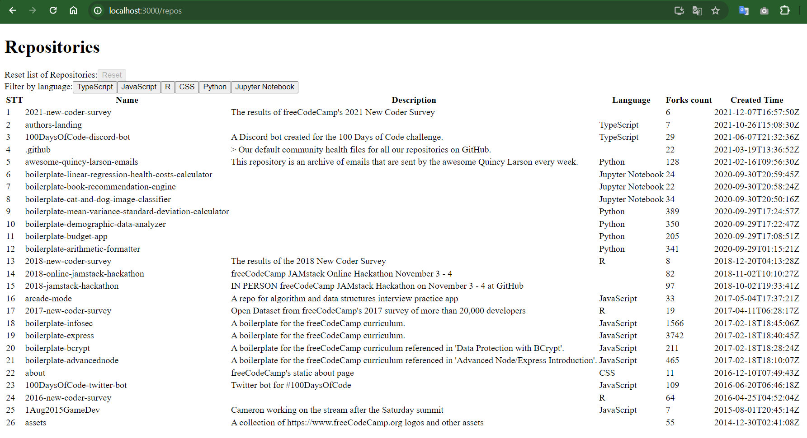

Tasks
-----
### (A) Node/Express

1. Create a simple web server using Express framework
2. Implement the `/repos` API endpoint
3. The endpoint should aggregate GitHub repository data from the
following sources: https://api.github.com/users/freeCodeCamp/repos
4. Only return repositories where `repository.fork` is `false` and `repository.forks` is greater than 5.
5. Return results as JSON-encoded data with a content-type of `application/json`.

### (B) React

1. Start a simple web app using React
2. Fetch repository data from the Express API created in (A).
3. Display a list of repositories. Include the repository name, description, language, and forks count in the list.
4. The list of repositories should be displayed in reverse chronological order by creation date.
5. Add buttons for each language type. Make clicking on a language button filter the list by language type.

### Optional points
6. Make each repository in the list clickable.
7. When you click a repository, display the most recent commit date, author, and message.
8. Include a way to return to the main list of repositories after you click on a repository.

Run
-----
### Backend
`npm install` 

`npx ts-node src.index.js`

### Frontend
`npm install`

`npm start`

Demo
-----
### Backend

### Frontend
#### List repos:

#### Filter repo by language:

#### Hover & Click repo:

#### View detail repo:

